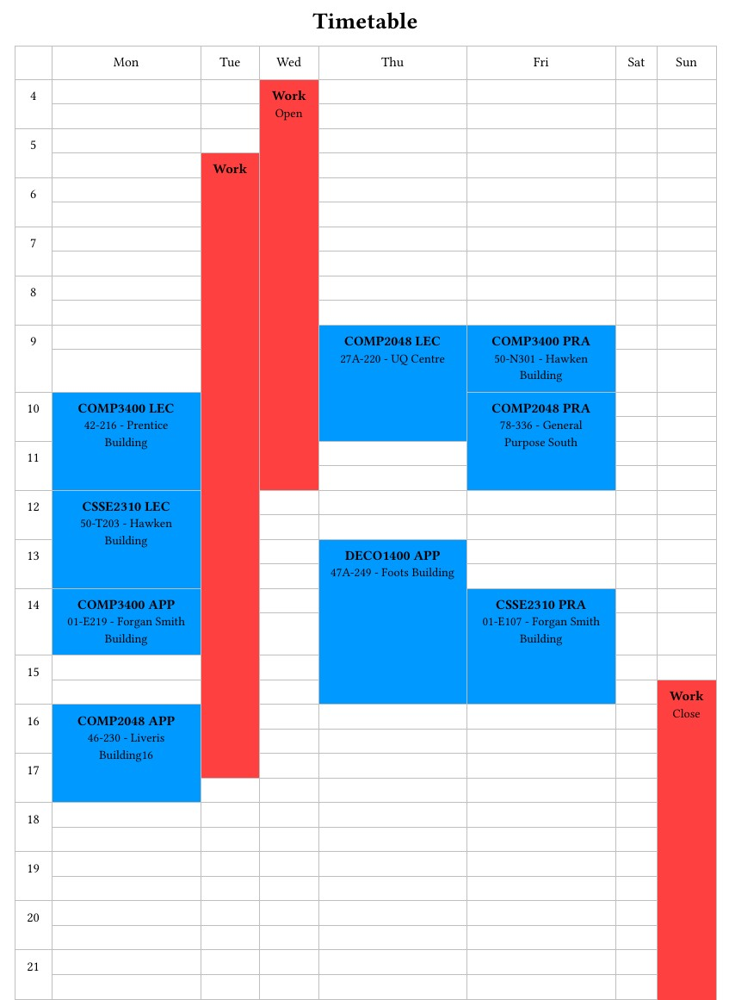

# TimeTabler
Weekly timetable creator.

Provides GUI to add events to a timetable, exports to PDF using Typst.

Multiple timetables are not yet supported. The application will always open the timetable saved at
`timetables/Timetable.json`, creating a new, blank timetable at this location if no such file
exists. Renaming a timetable will save it under its new name, however the application does not yet
provide an option to open it.

Currently requires Typst to be installed on your machine and in system PATH.